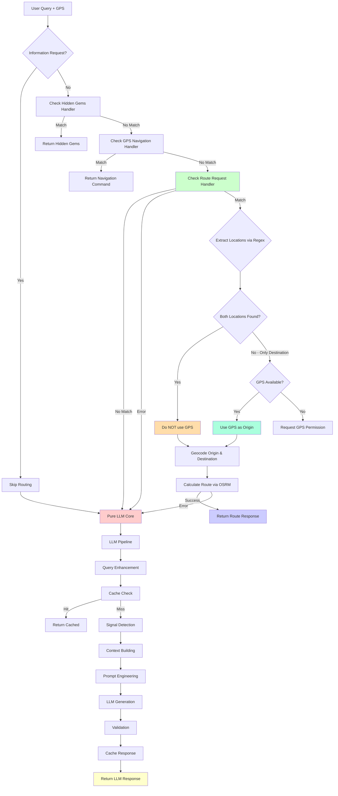

# Visual Flow Diagram

This diagram shows the complete decision tree from user query to response.

## Color Legend:
- 🔴 **Red (Pure LLM Core)**: LLM processing
- 🟢 **Green (Route Handler)**: Route request matching
- 🔵 **Blue (Route Response)**: Direct route returned (no LLM)
- 🟡 **Yellow (LLM Response)**: LLM-generated response
- 🟠 **Orange (GPS Decision)**: GPS usage logic

## Critical Decision Points:

### 1️⃣ Information Request Detection
```
Query: "what are the best museums"
↓
Detected as information request
↓
Skip all routing handlers
↓
Go directly to Pure LLM
```

### 2️⃣ Route Pattern Matching
```
Query: "how can I go to Taksim from Kadikoy"
↓
Matches route pattern: ✅
↓
Regex extracts: origin="Kadikoy", destination="Taksim"
↓
Both locations found: ✅
↓
GPS NOT used
↓
Calculate route
↓
Return route response (no LLM)
```

### 3️⃣ GPS Fallback
```
Query: "how to get to Taksim"
↓
Matches route pattern: ✅
↓
Regex extracts: destination="Taksim", origin=None
↓
Only destination found
↓
GPS available? ✅
↓
Use GPS as origin
↓
Calculate route
↓
Return route response (no LLM)
```

### 4️⃣ LLM Fallback
```
Query: "show me interesting places"
↓
No route pattern match
↓
Fall through to Pure LLM
↓
Signal detection: "attractions"
↓
Context building: fetch POIs from database
↓
LLM generates informative response
↓
Return LLM response with map data
```

## Key Flows:

### Fast Path (No LLM):
```
User Query → Route Handler → Regex Extract → Geocode → OSRM → Route Response
Time: ~500ms - 1s
```

### LLM Path (Information/Fallback):
```
User Query → Pure LLM → Enhancement → Cache → Signals → Context → Prompt → LLM → Response
Time: ~2-4s (with cache: ~100-200ms)
```

### Hybrid Path (Route with Map + Context):
```
User Query → Route Handler → Calculate Route → Pure LLM (for context) → Enhanced Response
Time: ~1-3s
```

---

**Generated**: January 2025  
**Status**: Complete routing + LLM integration
